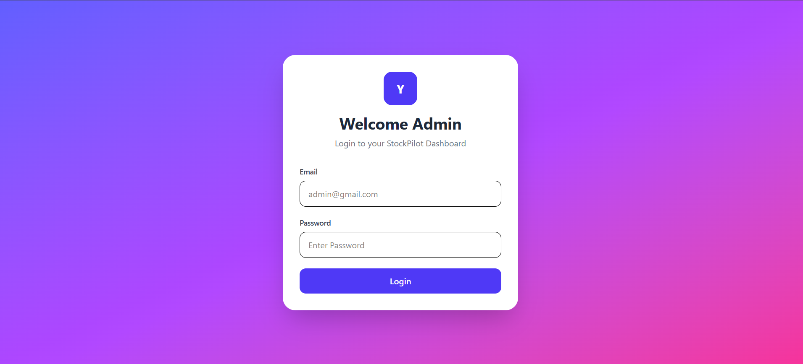
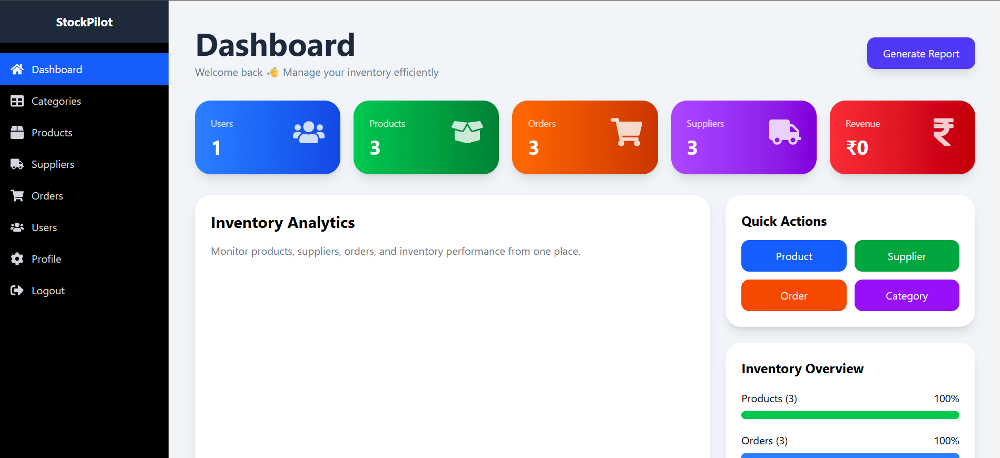
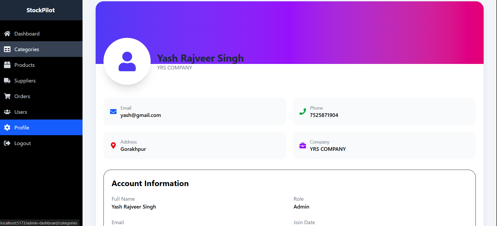
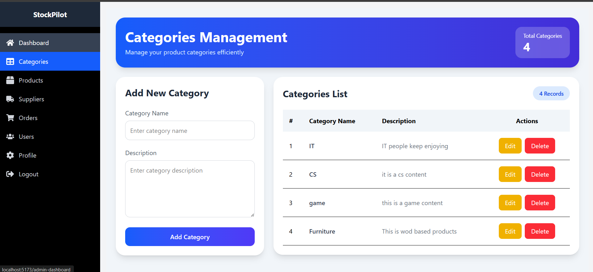

# 📦 StockPilot - Inventory Management System

## 📖 Overview

StockPilot is a full-stack Inventory Management System designed to streamline inventory operations for businesses. It provides a centralized platform to manage products, categories, suppliers, orders, and users while offering real-time inventory tracking and analytics.

The system helps organizations maintain accurate stock records, improve operational efficiency, and reduce inventory management complexity through an intuitive dashboard and secure role-based access control.

---

## ✨ Features

### 🔐 Authentication & Authorization
- Secure User Registration and Login
- JWT-Based Authentication
- Protected Routes
- Role-Based Access Control (RBAC)

### 📊 Dashboard
- Total Products Overview
- Total Categories Overview
- Total Suppliers Overview
- Total Orders Overview
- Inventory Insights & Statistics

### 📦 Product Management
- Add New Products
- Update Product Information
- Delete Products
- Search & Filter Products
- Manage Product Quantity and Pricing

### 🏷️ Category Management
- Create Categories
- Edit Categories
- Delete Categories
- View Category Listings

### 🚚 Supplier Management
- Add New Suppliers
- Update Supplier Details
- Delete Suppliers
- Supplier Status Tracking

### 📋 Order Management
- Create Orders
- View Order History
- Update Order Status
- Track Inventory Movement

### 👤 User Management
- Manage User Accounts
- Assign User Roles
- Update User Profiles

---

## 🛠️ Technology Stack

### Frontend
- React.js
- React Router DOM
- Axios
- Tailwind CSS
- React Icons

### Backend
- Node.js
- Express.js

### Database
- MongoDB
- Mongoose

### Authentication & Security
- JSON Web Token (JWT)
- bcrypt.js

---

## 📁 Project Structure

```bash
StockMaster/
│
├── frontend/
│   ├── src/
│   │   ├── components/
│   │   ├── pages/
│   │   ├── services/
│   │   ├── context/
│   │   ├── routes/
│   │   └── App.jsx
│   │
│   └── package.json
│
├── backend/
│   ├── config/
│   ├── controllers/
│   ├── middleware/
│   ├── models/
│   ├── routes/
│   ├── utils/
│   └── server.js
│
├── .gitignore
├── README.md
└── package.json
```

---

## ⚙️ Installation Guide

### 1️⃣ Clone the Repository

```bash
git clone https://github.com/your-username/stockmaster.git
cd stockmaster
```

### 2️⃣ Install Backend Dependencies

```bash
cd backend
npm install
```

### 3️⃣ Install Frontend Dependencies

```bash
cd frontend
npm install
```

---

## 🔧 Environment Variables

Create a `.env` file inside the backend directory:

```env
PORT=5000

MONGO_URI=your_mongodb_connection_string

JWT_SECRET=your_jwt_secret_key
```

---

## ▶️ Running the Application

### Start Backend Server

```bash
cd backend
npm run dev
```

Backend Server:

```bash
http://localhost:5000
```

### Start Frontend Application

```bash
cd frontend
npm run dev
```

Frontend Application:

```bash
http://localhost:5173
```

---

## 📡 API Endpoints

### Authentication

| Method | Endpoint | Description |
|----------|-------------|-------------|
| POST | `/api/auth/register` | Register User |
| POST | `/api/auth/login` | Login User |
| GET | `/api/auth/profile` | Get User Profile |

### Categories

| Method | Endpoint |
|----------|-------------|
| GET | `/api/category` |
| POST | `/api/category` |
| PUT | `/api/category/:id` |
| DELETE | `/api/category/:id` |

### Products

| Method | Endpoint |
|----------|-------------|
| GET | `/api/product` |
| POST | `/api/product` |
| PUT | `/api/product/:id` |
| DELETE | `/api/product/:id` |

### Suppliers

| Method | Endpoint |
|----------|-------------|
| GET | `/api/supplier` |
| POST | `/api/supplier` |
| PUT | `/api/supplier/:id` |
| DELETE | `/api/supplier/:id` |

### Orders

| Method | Endpoint |
|----------|-------------|
| GET | `/api/order` |
| POST | `/api/order` |
| PUT | `/api/order/:id` |
| DELETE | `/api/order/:id` |

---

## 🔒 Security Features

- JWT Authentication
- Password Hashing with bcrypt
- Protected API Routes
- Input Validation
- Secure User Sessions
- Role-Based Access Control

---

## 📈 Future Enhancements

- Barcode Scanner Integration
- Inventory Forecasting
- Low Stock Alerts
- Email Notifications
- PDF & Excel Report Export
- Multi-Warehouse Management
- Advanced Analytics Dashboard
- Dark Mode Support

---

## 🎯 Learning Outcomes

This project demonstrates practical implementation of:

- Full-Stack Web Development
- RESTful API Development
- Authentication & Authorization
- MongoDB Database Design
- React State Management
- CRUD Operations
- Dashboard Development
- Role-Based Access Control

---

## 👨‍💻 Author

**Yash Rajveer Singh**

Pre-Final Year B.Tech (Information Technology)

### Skills
- React.js
- Tailwind CSS
- Node.js
- Express.js
- MongoDB
- SQL
- REST APIs

---


## Login Page


## Dashboard



## Categories



## Products



## Profile



## 📜 License

This project is developed for educational and portfolio purposes.

Feel free to use, modify, and enhance the project according to your requirements.

---

### ⭐ If you found this project useful, consider giving it a star on GitHub!
